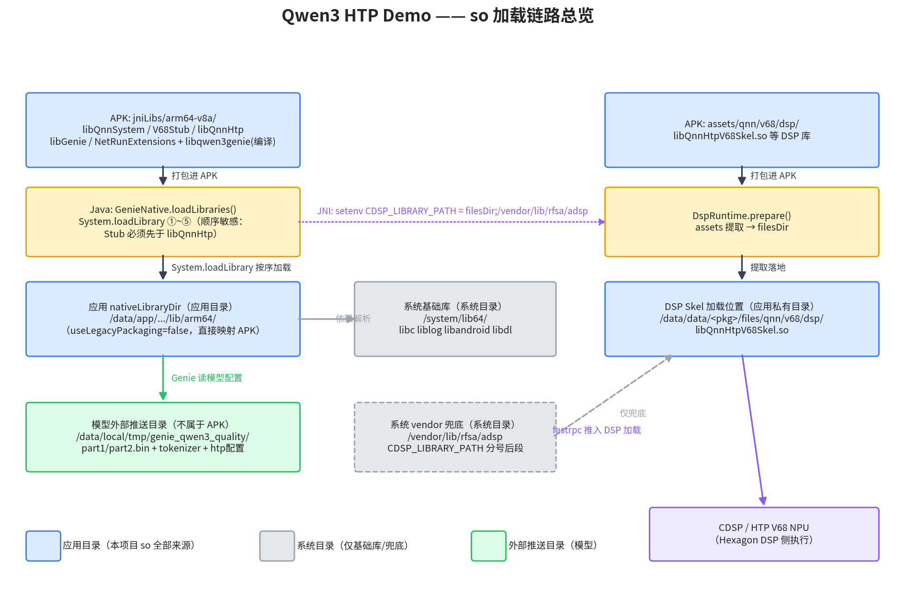

# so 加载链路说明

> 适用工程：`geniehtp/`（推理 library 模块，AAR 形态）+ `app/`（外壳）
> 结论先行：**本项目的全部 QNN / Genie so 都从应用目录加载，系统目录只提供 libc 等基础库和 vendor 兜底路径。**

## 一、宿主侧（APK 进程，arm64）

`GenieNative.loadLibraries()`（`geniehtp/src/main/java/com/qairt/qwen3htp/GenieNative.java`）按固定顺序 `System.loadLibrary` 五连加载：

1. `libQnnSystem.so`
2. `libQnnHtpV68Stub.so` —— **必须先于 libQnnHtp**，否则 `populateGraphBinaryInfo failed`
3. `libQnnHtp.so`
4. `libGenie.so`
5. `libqwen3genie.so`（本项目自有 JNI 桥，CMake 编译）

这些 so 的打包来源是 `geniehtp/src/v{68|73}Qnn{234|246}/jniLibs/arm64-v8a/`（由渠道 flavor 决定，见 `geniehtp/src/main/cpp/CMakeLists.txt` 的 `RUNTIME_DIR`）。安装后位于应用 `nativeLibraryDir`（`/data/app/.../lib/arm64/`，`useLegacyPackaging=false` 时直接映射 APK，不落地解压）。`libGenie.so` 在 CMake 中是 IMPORTED 库，`libqwen3genie` 链接它以及 `android/log`、`dl`。

**系统目录只参与基础库解析**：`/system/lib64/` 下的 `libc / liblog / libandroid / libdl` 由动态链接器按依赖自动解析，项目不主动加载系统里的任何 QNN so。

## 二、DSP 侧（CDSP / Hexagon NPU）

1. `DspRuntime.prepare()` 把 AAR 内 `assets/qnn/v68/dsp/*`（`libQnnHtpV68Skel.so` 等）提取到应用私有目录 `filesDir`（`/data/data/<pkg>/files/qnn/v68/dsp/`）。
2. JNI `configureRuntimePaths` 设置环境变量 `ADSP_LIBRARY_PATH` / `CDSP_LIBRARY_PATH` / `CDSP1_LIBRARY_PATH` 三个变量，值均为 `filesDir;/vendor/lib/rfsa/adsp` —— 分号前是应用目录（首选），分号后的 vendor 分区**仅兜底**。
3. `buildConfig` 生成 Genie 配置 JSON：backend=QnnHtp、ctx-bins 指向模型目录 part1/part2、tokenizer、`htp_backend_ext_config.json` 扩展，并对 skel 做 `requireFile` 校验。
4. 运行时链路：`libQnnHtp → libQnnHtpV68Stub → fastrpc → DSP 侧加载 filesDir 里的 libQnnHtpV68Skel.so`。

## 三、模型文件

模型（part1/part2.bin + tokenizer + htp 配置）**不在 APK/AAR 内**。`GenieHtpEngine.defaultModelRoot()` 按优先级取模型根目录：

1. 应用私有目录 `/data/data/<pkg>/files/models/<flavor>/`（存在即优先，适配 SELinux Enforcing / 多用户场景）；
2. 兜底外部推送目录 `/data/local/tmp/genie_qwen3_quality/`（当前 S32L 实机走这条）。

Genie 按 buildConfig 生成的配置 JSON 读取该目录下的 `part1_of_2.bin` / `part2_of_2.bin` / `tokenizer.json` / `htp_backend_ext_config.json`，加载前逐一 `requireFile` 校验。

## 四、一句话总结

| 内容 | 来源目录 |
| --- | --- |
| 全部 QNN/Genie so（宿主 5 个 + DSP skel） | 应用目录（APK 打包 / filesDir 提取） |
| libc / liblog / libandroid / libdl | 系统目录 `/system/lib64/`（链接器自动解析） |
| `/vendor/lib/rfsa/adsp` | 仅 CDSP_LIBRARY_PATH 兜底，正常不加载 |
| 模型权重与 tokenizer | 应用私有 `files/models/<flavor>/` 优先，兜底外部推送 `/data/local/tmp/genie_qwen3_quality/` |

---

生成脚本：`scripts/gen_so_loading_chain_diagram.py`（修改后重跑即可更新 `docs/so-loading-chain.png`）。
